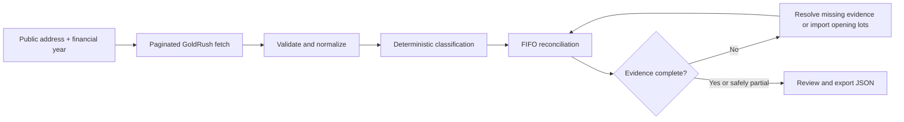

# LedgerProof India

An evidence-first, deterministic crypto tax reconciliation preview for public
Ethereum wallets.

LedgerProof India fetches public wallet activity, validates supported asset
movements, reconciles FIFO lots with exact integer arithmetic, asks for missing
off-chain evidence, and exports a reviewable report. The current rule-only
release does not call OpenAI or any other LLM. Classification and tax arithmetic
use deterministic rules. A future OpenAI provider enhancement would be
optional, server-only, and unable to control quantities, FIFO, gains, losses,
or tax arithmetic.

> LedgerProof India is an educational reconciliation preview. It is not tax
> advice, an ITR filing service, or a replacement for a qualified tax
> professional.

## Current product

The public, no-login application supports:

- Ethereum mainnet public addresses;
- Indian financial-year selection;
- paginated GoldRush history with a 250-record public-demo cap;
- ETH, WETH, USDC, and USDT validated by contract address, decimals, and token
  standard rather than symbol alone;
- deterministic `buy`, `sell`, `swap`, `transfer_in`, `transfer_out`, `gas`,
  `approval`, and `unknown` classifications;
- FIFO lot matching with INR paise and token quantities stored as integers;
- a missing-evidence workflow that reruns calculations after the user supplies
  actual INR paid or received;
- optional opening FIFO lots from a locally parsed CSV;
- quarantine of isolated unsupported inbound token spam without discarding
  valid supported movements;
- precise complete, partial, blocked, no-disposal, and genuine-zero states;
- a labelled static demo ledger;
- JSON evidence export, including quarantined and unsafe unsupported movements;
  and
- an optional, disabled-by-default Base Sepolia hash receipt after a report is
  complete.

No login, seed phrase, or private key is required. A browser wallet is requested
only when the user explicitly opens the optional receipt flow.

## Core workflow



### Deterministic rule engine

The application has no required OpenAI dependency, and the current release does
not make OpenAI requests. The UI states:

> DETERMINISTIC RULE ENGINE — tax calculations do not depend on AI.

Rules and user-validated evidence classify the transactions. TypeScript and
`BigInt` own every quantity, cost-basis, gain, loss, and tax calculation. No
provider or natural-language model can supply financial arithmetic.

A future optional OpenAI enhancement may assist only with strictly validated
classification or plain-language explanation. Missing credentials, provider
errors, or invalid model output must leave the deterministic rule engine fully
usable and must never change financial arithmetic.

### Missing evidence

Blockchain history does not prove actual INR purchase cost, INR sale proceeds,
wallet ownership, or special gift/reward treatment. The results page shows only
transactions needing evidence and allows the user to select:

- Bought for INR;
- Sold for INR;
- Transfer between my wallets;
- Gift / reward / airdrop; or
- Unknown — keep excluded.

INR is requested only when the selected treatment requires it. Rupees are
converted to integer paise and sent to `/api/analysis/report`; the deterministic
engine then reruns FIFO and immediately replaces the report.

### Spam quarantine

Unsupported movements follow conservative rules:

- unsupported inbound token with no wallet outflow: quarantine as possible
  spam;
- unsupported token sent by the wallet: keep in review;
- unsupported token received while a supported asset was sent: keep in review
  because it may be swap consideration.

Token symbols are never trusted. Contract address, decimals, and standard must
match the supported registry. Quarantined movements remain in the JSON evidence
export.

### Financial-year coverage

GoldRush pagination continues until enough earlier acquisition context is
available, the provider history ends, or the 250-record demo cap is reached.
The report explicitly displays `Complete history: Yes/No`. A cap or provider
boundary never silently becomes a complete report.

When full acquisition history is unavailable, the user may add an opening-lot
CSV after loading the live wallet:

```csv
asset,quantity,acquired_at,cost_basis_inr,transaction_hash
ETH,0.25,2024-04-10,54000,0xaaaaaaaaaaaaaaaaaaaaaaaaaaaaaaaaaaaaaaaaaaaaaaaaaaaaaaaaaaaaaaaa
```

The browser parses and validates the file locally. It does not upload or store
the original CSV. Only structured, validated lots are submitted for the current
calculation.

### Pricing boundaries

- Historical CoinGecko INR prices are optional and used only for supported,
  two-sided swaps.
- Actual exchange/CSV INR evidence is required for buys and sells.
- Market price is never substituted for the user’s actual purchase cost.
- Unavailable pricing produces a blocked or partial state, never an invented
  value.

The simplified 30% preview is informed by
[Income Tax Act Section 115BBH](https://www.incometaxindia.gov.in/w/section-115bbh-4),
which addresses income from transfer, cost of acquisition, and loss set-off.
LedgerProof labels FIFO as its accounting assumption; it does not claim that
Section 115BBH mandates FIFO.

### Optional Base Sepolia receipt

The report remains complete without a blockchain receipt. The receipt panel is
unavailable unless `NEXT_PUBLIC_BASE_SEPOLIA_REPORT_RECEIPT_ADDRESS` contains a
reviewed deployed contract address.

When enabled, the browser:

1. canonicalizes the in-memory report using
   `ledgerproof-report-receipt-v1`;
2. recursively sorts object keys while preserving array order;
3. encodes that canonical JSON string as UTF-8;
4. computes `keccak256` with viem;
5. checks Base Sepolia and duplicate status; and
6. asks for a separate user confirmation before sending `mintReceipt`.

Only the `bytes32` hash, signing address, and block timestamp are public. The
contract does not store reports, wallet history, tax figures, names, or personal
information. A deterministic hash can still be linkable if somebody already
has the underlying report, so the report should remain private.

## Result states

The UI distinguishes:

- `No supported disposals detected`;
- `Calculation blocked: acquisition cost missing`;
- `Calculation blocked: sale or swap valuation missing`;
- `Partial calculation`;
- `Complete calculation`; and
- `₹0 calculated — complete`.

This prevents “no sale occurred” from looking like an application failure.
Positive VDA gains and VDA losses remain separate. The preview excludes
surcharge and TDS credit; 4% cess is included only when explicitly selected by
the request.

## Technology

| Layer | Technology | Responsibility |
| --- | --- | --- |
| Application | Next.js App Router + TypeScript | Public UI and server routes |
| Validation | Zod | Requests, provider data, evidence, and report schemas |
| On-chain data | GoldRush by Covalent | Ethereum transaction history |
| Historical prices | CoinGecko | Optional supported swap/date INR evidence |
| Accounting | TypeScript + `BigInt` | Rules, FIFO, and tax arithmetic |
| Optional receipt | Solidity + viem | Hash-only Base Sepolia proof |
| Unit/API tests | Vitest | Schemas, providers, evidence, and reconciliation |
| Browser tests | Playwright | Core user flow and failure states |
| Deployment | Vercel | Public hackathon deployment |

No receipt contract is deployed by this repository. The feature remains
unavailable until a public address is deliberately configured.

## Project structure

```text
src/
  app/api/
    analysis/fetch/
    analysis/report/
    health/
  components/
    address-analyzer.tsx
    analysis-results.tsx
    evidence-review.tsx
    report-receipt-panel.tsx
  lib/
    asset-registry.ts
    coingecko.ts
    financial-year.ts
    goldrush.ts
    opening-lot-csv.ts
    reconciliation.ts
    report-receipt.ts
    schemas.ts
    tax-report.ts
contracts/
  ReportReceipt.sol
  ReportReceipt.t.sol
scripts/
  deploy-report-receipt.ts
tests/
  e2e/
  fixtures/
docs/codex-runs/
```

## Local development

Requirements:

- Node.js 22.13 or newer;
- a GoldRush API key for live wallet history; and
- an optional CoinGecko API key for supported historical swap prices.

No OpenAI key is required or read by the current rule-only release.

Create `.env.local` from `.env.example` and set server-only variables:

```text
GOLDRUSH_API_KEY=
COINGECKO_API_KEY=
NEXT_PUBLIC_BASE_SEPOLIA_REPORT_RECEIPT_ADDRESS=
```

Never add `NEXT_PUBLIC_` to provider secrets.

Install and run:

```bash
npm install
npm run dev
```

Open `http://localhost:3000`.

## Verification

```bash
npm run lint
npm run typecheck
npm test
npm run build
npm run contract:compile
npm run contract:test
npm run test:e2e
npm run test:e2e:receipt
```

Required behavior includes:

- valid and invalid addresses;
- live and static-demo flows;
- empty history, provider rate limit, provider unavailability, and timeout;
- financial-year boundaries, pagination, and the 250-record cap;
- exact supported-token decimals and large integers;
- spam quarantine without loss of supported movements;
- unsafe unsupported outflows remaining in review;
- evidence-driven INR buy/sale recalculation;
- opening FIFO CSV validation;
- FIFO matching, missing acquisition lots, and swap-price failure;
- positive gain/VDA loss separation; and
- JSON evidence export with no secrets.

## Security and privacy

- Provider keys are server-only and are never returned by `/api/health`.
- Public API bodies and per-instance request counts are bounded for a hackathon
  deployment.
- Raw wallet histories, provider secrets, and reports are not logged.
- Token metadata is treated as untrusted input.
- The application never requests a private key or seed phrase.
- The optional browser-wallet flow sends only the canonical report hash to the
  configured Base Sepolia contract.
- The contract prevents zero hashes and duplicate hashes and stores only owner
  and timestamp metadata.
- Missing financial evidence is excluded rather than guessed.
- The original opening-lot CSV is not stored.

## Known limits

On-chain history may not reveal centralized-exchange trades, actual INR cost or
proceeds, ownership of another wallet, special airdrop/gift facts, TDS
certificates, residency, surcharge, or full DeFi/NFT context. GoldRush and
CoinGecko may also be unavailable or rate-limited.

The in-memory request budget is per server instance, which is suitable for the
hackathon demo but is not a distributed production rate limiter.

The Base Sepolia receipt is not a privacy guarantee, ownership proof, tax
attestation, or mainnet record. Browser wallets and testnet RPC access may be
unavailable, and duplicate prevention is global for each canonical report hash.

## Public links

- Application: [ledgerproof-india.vercel.app](https://ledgerproof-india.vercel.app/)
- Health check:
  [ledgerproof-india.vercel.app/api/health](https://ledgerproof-india.vercel.app/api/health)
- Repository:
  [Pratyush-kya/ledgerproof-india](https://github.com/Pratyush-kya/ledgerproof-india)

The health route reports provider-presence booleans and deterministic
classification mode. It never validates provider billing/credits and never
returns key values.

## Release gate

- [x] Public no-login landing and static demo.
- [x] Deterministic classification and arithmetic with no OpenAI dependency.
- [x] Evidence-driven recalculation and clear incomplete states.
- [x] No application secrets exposed.
- [x] Current release `d1b6932` is deployed to Vercel Production.
- [x] Known active wallet reverified on that deployment.
- [x] Optional Day 8 receipt implementation remains disabled until a contract
  address is reviewed and configured.

## License

MIT. See [LICENSE](./LICENSE).
