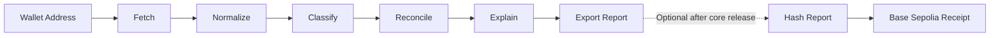

# LedgerProof India

An evidence-first crypto tax reconciliation agent for public EVM wallets.

LedgerProof India reads a wallet's on-chain activity, converts raw blockchain
records into a consistent ledger, classifies each transaction, calculates a
transparent Indian VDA tax preview, and explains the result in plain English.

> **Important:** This project provides a tax-reconciliation preview for
> educational and review purposes. It is not tax advice, an ITR filing service,
> or a replacement for a qualified tax professional.

## Hackathon

- **Event:** ChatGPT Codex India Hackathon 2026
- **Primary track:** Theme 4 - Domain Agents
- **Secondary inspiration:** Theme 6 - Bharat business and ledger reconciliation
- **Submission deadline:** 3 August 2026
- **Current status:** Active hackathon build

## Problem

Public wallet histories are difficult to understand because they contain raw
contract calls, token transfers, gas payments, swaps, approvals, and incomplete
context. Users must still determine:

- what each transaction represents;
- which transactions may be taxable disposals;
- how acquisition lots match later disposals;
- which records have enough information for an INR estimate;
- which records require manual review; and
- how the result can be explained and independently verified.

LedgerProof India turns that technical history into a reviewable ledger while
keeping facts, model inferences, deterministic calculations, and unknowns
visibly separate.

## Core Objective

Given a public Ethereum wallet address, the application should:

1. fetch a defined range of on-chain transactions;
2. normalize provider-specific data into one internal format;
3. classify transactions as buys, sells, swaps, transfers, gas, approvals, or
   unknown activity;
4. reconcile supported acquisition and disposal lots using deterministic FIFO
   logic;
5. calculate a limited, source-dated Indian VDA tax preview;
6. explain the result in plain English with confidence and evidence; and
7. export a report that the user can inspect independently.

## Workflow



### 1. Address

The user enters a public EVM wallet address. Reading public blockchain history
does not require wallet connection, a private key, or a seed phrase.

### 2. Fetch

A server-side API route requests Ethereum transaction history from GoldRush by
Covalent. Provider credentials remain on the server and are never exposed to
the browser.

### 3. Normalize

Provider-specific records are converted into a stable internal transaction
schema containing fields such as:

- transaction hash;
- block timestamp;
- asset and token contract;
- raw integer amount and token decimals;
- sender and recipient;
- gas paid;
- decoded method or event information; and
- block-explorer URL.

### 4. Classify

Deterministic rules handle obvious records. A constrained LLM agent can help
classify ambiguous activity and must return validated structured data:

- category;
- confidence;
- short reason;
- evidence transaction hashes; and
- `needsReview`.

The model does not calculate prices, gains, or tax totals.

### 5. Reconcile

Pure TypeScript code performs the financial calculations. Supported
acquisitions and disposals are matched using FIFO. Token base units and INR
paise are stored as integers to avoid floating-point accounting errors.

### 6. Explain

The results page presents four distinct information types:

- **Fact:** directly observed on-chain;
- **Inference:** classification produced by rules or the LLM;
- **Estimate:** deterministic result based on included prices and lots; and
- **Needs review:** information that is missing or unsafe to assume.

### 7. Export

The user can download a JSON report containing coverage, transaction evidence,
classifications, matched lots, calculations, exclusions, and limitations.

### Optional Web3 Receipt

After the core application is production-ready, a user may hash the canonical
report and submit only its `keccak256` fingerprint to a small contract on Base
Sepolia. The receipt proves that a particular report version was submitted at a
particular time. It does not prove that the tax calculation is legally correct.

No raw report, transaction history, PAN, name, or other personal information
should be written on-chain.

## MVP Scope

The first release intentionally supports:

- Ethereum mainnet wallet addresses;
- a capped transaction range for reliable demo performance;
- ETH, WETH, USDC, and USDT in the initial priced-asset registry;
- `buy`, `sell`, `swap`, `transfer_in`, `transfer_out`, `gas`, `approval`, and
  `unknown` classifications;
- FIFO lot reconciliation;
- historical INR valuation where a supported price is available;
- visible exclusions and low-confidence records;
- plain-English report generation;
- JSON report export; and
- a clearly labelled static demo ledger for reliable evaluation.

The MVP does not attempt:

- direct ITR filing;
- tax payment or TDS-credit calculation;
- PAN, KYC, or user-account management;
- centralized-exchange account import;
- every chain, token, bridge, NFT, or DeFi protocol;
- automatic ownership detection across multiple wallets; or
- individualized legal or tax conclusions.

Historical market prices are applied only to a confirmed, two-sided supported
asset swap. A one-sided wallet movement is not treated as proof of a purchase,
sale, or cost basis. If a historical price, acquisition lot, or other required
fact is unavailable, the UI says `Not calculated` instead of displaying a
zero-value estimate.

## Tax-Preview Rules

The application should keep tax rules in a source-dated configuration and
recheck official guidance before release.

For the simplified preview:

- positive priced VDA gains are shown separately;
- VDA losses are displayed but are not silently netted against positive gains;
- acquisition cost is tracked through matched lots;
- gas is recorded but is not silently treated as a deductible expense;
- a 30% base-tax estimate may be shown with a separately labelled illustrative
  cess component; and
- surcharge, residency, TDS credit, filing status, and unavailable off-chain
  facts are excluded.

## Technology Stack

| Layer | Technology | Responsibility |
| --- | --- | --- |
| Web application | Next.js App Router + TypeScript | Public UI and server routes |
| Styling | Tailwind CSS | Responsive interface |
| Validation | Zod | Input, provider, and LLM schema validation |
| On-chain data | GoldRush by Covalent | Ethereum wallet transaction history |
| Historical prices | CoinGecko | Supported asset/date INR valuations |
| Explanation agent | OpenAI API | Structured classification and explanation |
| Accounting engine | TypeScript + `BigInt` | FIFO and deterministic calculations |
| Unit tests | Vitest | Schema, normalization, classification, and ledger tests |
| Browser tests | Playwright | Core user flow and error states |
| Deployment | Vercel | Public hackathon deployment |
| Optional Web3 | Solidity + viem + Base Sepolia | Report-hash receipt |

## Implemented Project Structure

```text
src/app/
  api/
    analysis/
      fetch/
      report/
  page.tsx
src/components/
src/lib/
  goldrush.ts
  coingecko.ts
  transaction-agent.ts
  reconciliation.ts
  tax-report.ts
  request-guard.ts
docs/
  codex-runs/
tests/
  fixtures/
.github/
  workflows/
    ci.yml
```

The optional smart-contract receipt is not part of the current core build.

## Local Development

### Prerequisites

- Node.js 20 or newer
- npm, pnpm, or another compatible package manager
- GoldRush API credentials
- OpenAI API credentials
- optional CoinGecko API credentials
- optional browser wallet and Base Sepolia test ETH for the receipt feature

### Environment

Create `.env.local` from `.env.example`:

```bash
cp .env.example .env.local
```

Expected server-side variables:

```text
GOLDRUSH_API_KEY=
OPENAI_API_KEY=
OPENAI_MODEL=
COINGECKO_API_KEY=
```

Do not prefix secrets with `NEXT_PUBLIC_`. Values using that prefix are exposed
to browser code.

### Install and Run

```bash
npm install
npm run dev
```

Open `http://localhost:3000`.

### Public deployment

- Application: [ledgerproof-india.vercel.app](https://ledgerproof-india.vercel.app/)
- Health/configuration check:
  [ledgerproof-india.vercel.app/api/health](https://ledgerproof-india.vercel.app/api/health)

The health route returns only provider-configuration booleans and the selected
model name. It never returns API-key values. A successful deployment still
needs one manual analysis using a known active Ethereum address before
submission.

### Verification

```bash
npm run lint
npm run typecheck
npm test
npm run build
npx playwright test
```

These commands are the intended release checks. Update them if the implemented
package scripts use different names.

## Required Test Coverage

- valid and invalid EVM addresses;
- malformed or incomplete provider responses;
- token decimals and large integer amounts;
- pagination and transaction limits;
- every supported classification;
- invalid LLM JSON and unsupported categories;
- prompt-injection-shaped token metadata;
- FIFO lot matching;
- missing acquisition lots;
- unavailable historical prices;
- VDA loss separation;
- gas treatment;
- live, empty, loading, timeout, and upstream-error UI states; and
- optional receipt hashing, duplicate prevention, wrong network, and wallet
  rejection.

## Security and Privacy

- Never request or store a wallet seed phrase or private key.
- Keep all provider and model credentials server-side.
- Apply per-instance request budgets to public API routes and short-lived
  server caches to reduce duplicate provider requests.
- Treat transaction metadata and token strings as untrusted input.
- Validate LLM output before using it.
- Do not let the LLM perform financial arithmetic.
- Avoid logging raw reports or sensitive user activity.
- Store only the report hash in the optional smart contract.
- Use Base Sepolia, not a mainnet, for the hackathon receipt.

## Known Data Limitations

On-chain history may not reveal:

- centralized-exchange trades;
- the original INR acquisition value;
- whether another wallet belongs to the same user;
- whether a transfer is a sale, bridge, gift, or self-transfer;
- complete airdrop, staking, NFT, or DeFi context;
- residency, surcharge, filing status, or TDS certificates; or
- transactions outside the selected date and pagination range.

Records affected by these gaps must be marked `Needs review` and excluded from
automatic totals when a safe calculation is not possible.

## Demonstrating Genuine Codex Usage

The public commit history should show repeated agentic development cycles:

```text
Plan -> Build -> Test -> Self-review -> Fix -> Verify -> Commit
```

Each `docs/codex-runs/day-XX.md` file should record:

- the day's objective;
- the exact prompt supplied to Codex;
- the accepted plan;
- files changed;
- commands and tests executed;
- issues found during self-review;
- fixes applied; and
- the builder's own review decision.

Do not manufacture transcripts or claim tests that were not executed.

## Release Gate

The optional Web3 receipt must remain blocked until all core checks pass:

- [x] Public deployment is configured without application authentication.
- [ ] A fresh wallet analysis completes.
- [x] The labelled demo-ledger flow completes.
- [x] Facts, inferences, estimates, and unknowns are visibly separated.
- [x] LLM and deterministic fallback behavior are understandable.
- [x] Lint, tests, production build, and browser tests pass locally.
- [x] No API keys or wallet secrets are exposed.
- [x] README claims match the implemented product.
- [ ] Repository, deployment, and demo video show the same version.

## Submission Deliverables

- **Application:** [ledgerproof-india.vercel.app](https://ledgerproof-india.vercel.app/)
- **Public repository:** [Pratyush-kya/ledgerproof-india](https://github.com/Pratyush-kya/ledgerproof-india)
- **Three-minute demo:** Not recorded yet
- **Project Description:** Not published yet
- **Optional contract:** Not implemented; remains blocked behind the core
  release gate

Update each pending deliverable only after verifying that it is public and
matches the submitted release.

## License

MIT. See [`LICENSE`](./LICENSE).
